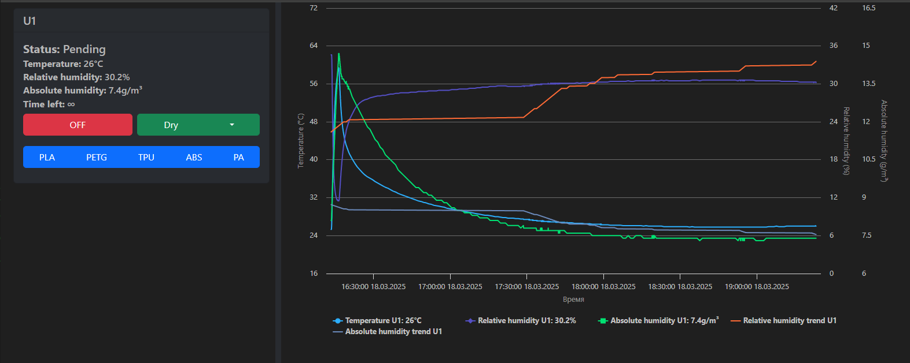
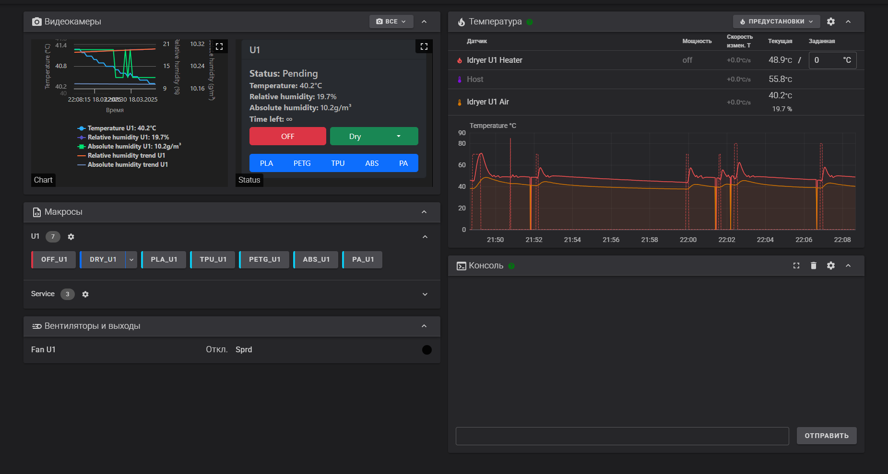

# PyUnit
PyUnit is a custom firmware for [iDryer Unit](https://github.com/pavluchenkor/iDryer-Unit) written in Python.

# Features

+ Separate web panel for drying control
+ Drying process graphs
+ Improved temperature control algorithms
+ Improved humidity control algorithms
+ Storage mode with humidity maintenance
+ Storage mode with temperature maintenance

# Description of Modes

## Pending
Standby mode, the dryer does nothing.

## Drying
Drying mode with a target humidity level. In this mode, the dryer maintains the set temperature with a possible overshoot of ``Max temperature delta``. After reaching the target humidity, it transitions to the next mode.

## Timer Drying
Drying mode with target humidity maintenance. In this mode, the dryer maintains the target humidity by lowering the drying temperature or opening the vent. If the ``Storage temperature`` parameter is set, the temperature will not drop below it. The mode lasts until the ``Dry time`` expires.

## Humidity Storage
Humidity maintenance mode. Activated after Timer drying if ``Storage temperature`` is not set. In this mode, the dryer maintains humidity within the specified range. If the humidity exceeds the allowed value, the dryer turns on the heater and dries for the duration of ``Humidity Dry Time``. The cycle then repeats.

## Temperature Storage
Humidity maintenance mode with temperature control. Activated after Timer drying if ``Storage temperature`` is set. In this mode, the ``Storage temperature`` is maintained, and the target humidity is attempted to be maintained. However, this may not be possible if the Storage temperature is too high.

# Requirements

Python 3.12 or higher. Lower versions of Python may be supported but have not been tested.

# Installation

1. Connect via SSH to your printer.
2. Navigate to the user's home directory.
   For example:
   ```bash
   cd /home/orangepi
   ```
3. Clone the repository:
   ```bash
   git clone https://github.com/xatang/PyUnit
   ```
4. Use nano or another editor to edit config.json.
   [Configuration parameters description](https://github.com/xatang/PyUnit/blob/main/CONFIG.md)
5. Run install.sh:
   ```bash
   bash install.sh
   ```
6. The service should start. You can access it at ``http://printer_ip:app_port/``


>Additionally, you can add the following commands to the Fluidd or Mainsail console filters to avoid a flood of messages during firmware operation.
```bash
SET_LED LED=[led_name] INDEX=
SET_HEATER_TEMPERATURE HEATER=[heater_name]
SET_SERVO SERVO=[servo_name]
```

# Control via Klipper Gcode Macro

1. To control the drying process via gcode macro, your printer must have the [gcode_shell_command](https://github.com/dw-0/kiauh/blob/master/docs/gcode_shell_command.md) extension installed.
2. After installation, modify the path to `config.json` in ``./idryer_macros/api.py`` to match your setup.
3. You can then replace your original ``U1.cfg`` with the contents of ``./idryer_macros/U1.cfg.example``. Be sure to change ``/home/orangepi`` to your actual path.

>The unit ID is essentially the index of ``config.json``, starting from 0.

>The preset number is also the index of the preset in each unit, starting from 0.

# Additional Web Pages

### http://printer_ip:app_port/webcam_chart
4:3 page that can be added as an HTTP webcam for viewing graphs.
### http://printer_ip:app_port/webcam_status
4:3 page that can be added as an HTTP webcam for viewing statuses.
### http://printer_ip:app_port/chart
Page displaying only graphs.

# Images



